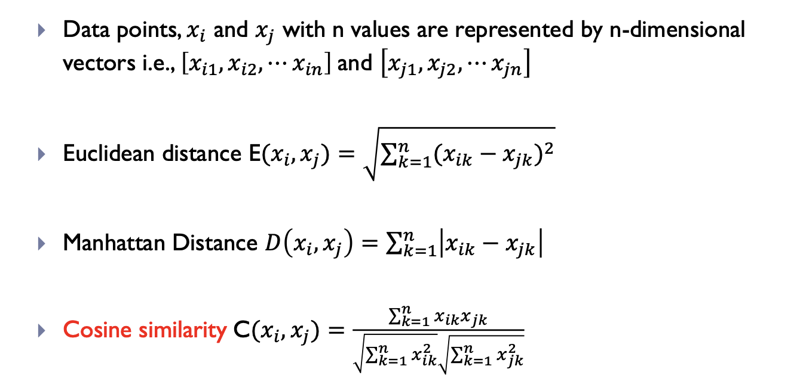

# 1. KNN classifier
1. 适用于 数值型数据，对分类和回归都可以使用，但对高维数据效果较差，高维会维度灾难，高维空间中距离度量变得无意义。
1. Inductive learning: Use f: x -> y
2. Lazy Learning: Find nearest or most likelihood record
3. Nearest-Neighbor Classifiers
   1. How to define what is close:

   Euclidean distance and Manhattan Distance are correlated.
   cosine are used in face recognization: you know what you want to match, better deal with scale
   1 and 3 most frequently.
   2. Need rescale to make every attributes in the same scale, or there might exists some attributes affect more
   3. use encode when number doesn't means big or small, use 1,2,... when diff category have relationships such as 收入高中低
   4. Important to choose right k because small k leads to sensitive to noise and bigger k leads to include points from other classes
   5. Determine Class lable
      1. majority vote: every neighbor has the same impact on the classification
      2. weighted voting scheme: weight = 1/D(x*,xi)^2
   6. How to Solve Scaling:
      1. Normalization: Min-max
      2. Normalization: Standardization, z-score
   7. Training can let we know the weight and best K，训练时间几乎为 0（无训练过程），预测时间非常高，每次预测都要计算所有样本的距离。
# 2. Decision Tree 
1. For Classification, 适用于 数值型和类别型数据，可处理缺失值，适用于分类和回归任务
2. There could be more than one tree that fits the same data!
3. Decision Tree Induction: A tree can be learned by splitting training data into subsets based on outcomes of a feature test. This process is recursively applied on each derived subset until the subset at a node has all the same value of the
target variable or there is no improvement for prediction
   1. Hunt's Algorithm：找到能完全分类的变量进行分类
   2. CART
   3. ID#
   4. C4.5
   5. SLIQ
   6. SPRINT
4. Greedy strategy
5. Issues:
   1. Determine how to split:
      * how to specify the attribute test condition?
         * Attribute types: Continuous: Discretization or Binary Decision (compute intensive)
         * Number of ways to split(2-way, multi-way)
      * How to determine the best split?
         * Gini Index：smaller better
           Used in CART, SLIQ, SPRINT
         有几个类别就减多少个
         

         * Entropy: smaller better
           
           

         * Information Gain: larger better
           Used in ID3, C4.5. Tends to prefer splits that result in large number of
partitions, each being small but pure.父节点的熵减去子节点的熵
           
     
           衡量IG指标：GainRatio:
信息增益的缺陷：IG 倾向选择取值多的特征（如身份证号）作为最优分裂特征，但这些特征实际上并不具备泛化能力。增益率的作用：通过分裂信息（SplitInfo）对信息增益进行归一化，避免 IG 偏向选择取值较多的特征。

         * Misclassification error，smaller better
           

   3. Determine when to stop splitting
      *  Stop expanding a node when all the records belong to the same class
      *  Stop expanding a node when all the records have similar attribute values
      *  Stop expanding a node when number of records is less than a threshold.
   4. Overfitting
      Overfitting results in decision trees that are more complex than necessary.
      Training error no longer provides a good estimate of how well the tree will perform on previously unseen records.
      Need new ways for estimating errors. Use generalization errors: Error on previously unseen testing set
      How to address:
      * Pre-Pruning:
           * Stop if number of instances is less than some user-specified threshold
           * Stop if the tree reach a maximum depth predefined by user.
           * Stop if class distribution of instances are independent of the available features.
           * Stop if expanding the current node does not improve generalization errors
      * Using Validation Set: 把训练集划分为训练集和测试集，交叉验证。
      * Post-Pruning:
           * 全部建好树之后再减，从下往上，可以根据generalization error选择是否剪枝，剪枝后的class由多数决定。

   6. General Error
      * Occam's Razor: Definition: Given two models of similar generalization errors, one should prefer the simpler model over the more complex model

# 3. SVM

   1. Small margins 更容易受到Noise的影响。而且会有更高的testing error rate comparing with large margin.
   2. seeks the hyperplane with maximum margin as a decision boundary to separate the data.
   3. 点到直线的距离公式
   4. Multi-class:多根线
# 4. Classifier Evaluation
   1. Evaluation:2-way data partitioning:train, test, test. 验证和超参数调整通常通过其他方式（例如交叉验证）来完成。
     1. Cross validation: Random subsampling, K-Fold cross-validation, Leave-one-out validation(Jackknife)
   3. Evaluation:3-way data partitioning:train, validate, test. 除了训练集和测试集外，还有一个独立的验证集，用于超参数调优、模型选择和防止过拟合。
   4. testing set cannot within training set
   5. 在机器学习中，2-way数据划分指的是将数据集划分为两部分：训练集和测试集。然而，使用这种划分方法时，存在一个问题：它不能同时满足所有模型训练和评估的需求。
      * 训练（Training）：在训练集上训练模型，让模型学习数据中的模式。
      * 模型选择（Model Selection）：选择最适合的模型或选择超参数的过程，这通常需要依赖于验证集。
      * 误差估计（Error Estimation）：对模型的预测误差进行估计，通常使用测试集来评估模型在未见过数据上的表现。
   6. 为什么2-way划分不能支持这三者：
      * 训练集：用于训练模型，但只包含了一部分数据。
      * 测试集：用于最终评估模型的性能，但如果你用测试集来进行模型选择或调优，那么测试集就不再是“独立的”，这会导致“数据泄露”（data leakage），影响评估的公平性。
        因此，当我们仅仅使用训练集和测试集时：
      * 训练集用于训练模型；
      * 测试集用于评估模型，但如果我们还用它来选择最佳模型或进行超参数调整，就会导致对测试集的“过度依赖”，从而影响其作为“未见过数据”的独立性和有效性。
# 5. Linear Regression

